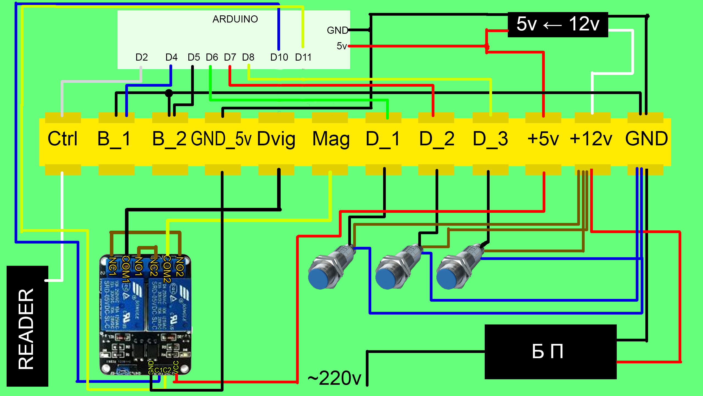
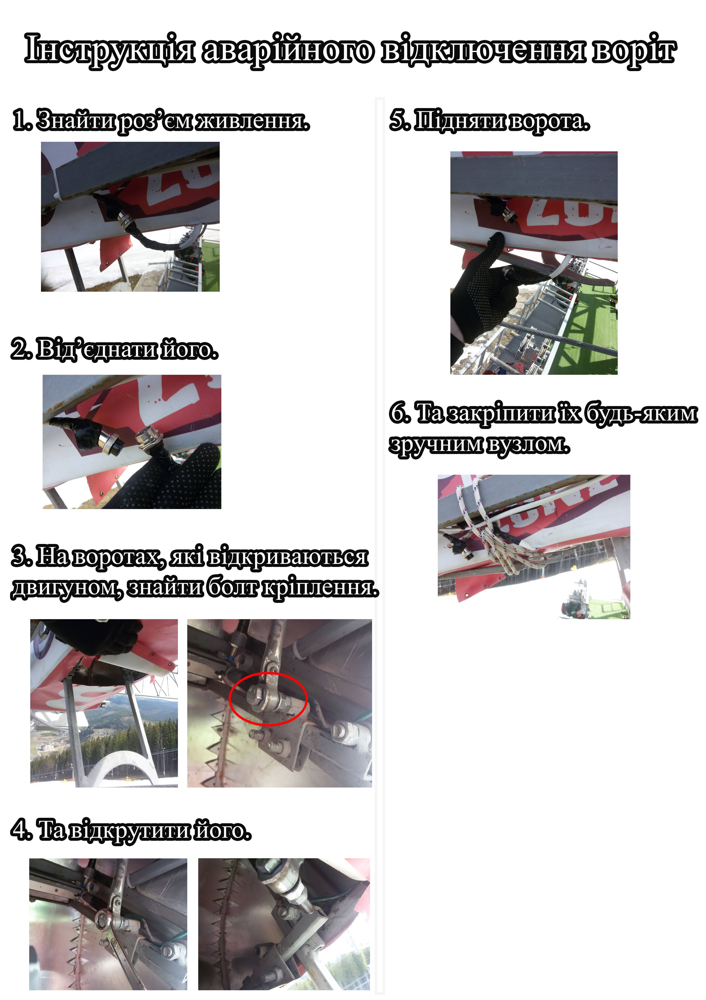

<h1 align="center">Управление воротами при помощи двигателя, индуктивных датчиков и электромагнита</h1>  
  <b>Работа кнопок:</b>
  <ul type="circle">
   <li>Обе кнопки работают по отпусканию. Последовательность кнопок имеет значение
    <li>Сначала должна быть нажата и отпущенна кнопка №1, а затем (в течении 3-х секунд) кнопка №2
    <li>Иначе, нажатие не засчитывается
    </ul>
  <b>Работа датчиков:</b>
  <ul type="circle">
    <li>Датчики реагируют на изменение индуктивности на расстоянии 4 см от себя
    <li>Корпус устройства из стали, поэтому датчик и регистрирует событие
    <li>При наличии преграды состояние: LOW, иначе HIGH
    <li>Один датчик используется для отслеживания состояния двери с магнитом (открытой/закрытой)
    <li>Остальные два для регистрации положения двери с двигателем, так как необходимо вовремя выключать двигатель
  </ul>
  <b>Старт програмы:</b>
    <ul type="circle">
    <li>Прогон двигателя в один проход 
    <li>Если зажата кнопка №1, делаем прогрев двигателя (20 повторов) 
  </ul>
  <b>Основной цикл:</b>
    Програма имеет 6 состояний: 
    <ul type="circle">
    <li>0: ожидание
    <li>1: открытие ворот двигателем
    <li>2: открытие ворот магнитом
    <li>3: проверка открытия магнитом (нет - переход к состоянию 2, да - к состоянию 4)
    <li>4: ожидание возврата двери и включение магнита, затем задержка 1 сек, и включение двигателя
    <li>5: выключение двигателя, проверка всех датчиков и переход в исходное состояние (иначе - к состоянию 4)
    </ul>

<ul type="circle">
<li>Ferma.ino - версия програмы 1.0
<li>Ferma_5_min.ino - тестовый скетч на 5 минут безпрерывной работы
<li>Ferma_v_2_0.ino - версия програмы 2.0
<li>Ferma_v_2_1.ino - версия програмы 2.1
<li>Ferma_v_2_2.ino - версия програмы 2.2
<li>Ferma_v_2_3.ino - версия програмы 2.3
<li>Ferma_v_2_4.ino - версия програмы 2.4 (последння)
</ul>

<h2 align="center"><b>Схема</b></h2>

<h2 align="center"><b>Подключение:</b></h2>
  <ul type="circle">
    <li>2 пин Arduino - управляющий сигнал (по умолчанию на ножке +5В, замыкая на землю - разрешаем управление)
    <li>3 пин Arduino - отладочная кнопка
    <li>4 пин Arduino - кнопка №1
    <li>5 пин Arduino - кнопка №2
    <li>6 пин Arduino - индуктивный датчик на воротах с магнитом (состояние: LOW - ворота закрыты, HIGH - открыты)
    <li>7 пин Arduino - индуктивный датчик на воротах с двигателем (состояние: LOW - ворота закрыты, HIGH - открыты)
    <li>8 пин Arduino - индуктивный датчик на воротах с двигателем (состояние: LOW - ворота открыты, HIGH - закрыты)
    <li>10 пин Arduino - выход на реле управление двигателем
    <li>11 пин Arduino - выход на реле управление магнитом
  </ul> 

<h1><b>История версий:</b></h1>
  2.0 
  <ul>
    <li>уменьшение времени открытия двери двигателем
    <li>исправлена ошибка с невозвратом в исходное положение после автозакрытия
    <li>отслеживания открытия двери двигателем перенесено в состояние 1
    <li>включение магнита перенесено в отдельную функцию (магнит включается только по датчику)
    <li>состояние 4 переделано, таймер автозакрытия объеденён с аварийным
    <li>время контроля кнопок уменьшено с 10 с до 3 с
  </ul>  
  2.1
  <ul>
    <li>добавлена сервисная кнопка на пине 3
    <li>добавлена функция "прогрева" двигателя в 20 повторений (при нажатии сервисной кнопки)
    <li>добавлена задержка до выключения магнита (для синхронизации нескольки устройств)
    <li>время синхронизации отслеживается по срабатыванию кнопок
   </ul> 
  2.2
  <ul>
    <li>добавлено включение магнита при автозакрытии (ранее включался через 3 секунды)   
  </ul> 
  2.3
  <ul>
    <li>сервисная кнопка привязана к прерыванию
    <li>удалены неиспользуемые переменные
    <li>почищен код
   </ul> 
  2.4
  <ul>
    <li>добавлена защита от дребезга контактов
    <li>константы переписаны в #define
    <li>сервисная кнопка объеденина с кнопкой №1
    <li>"прогрев" возможно запустить только при старте микроконтролера
    <li>исправлены ошибки при "зависании"  в состоянии 5  
  </ul>

<h2>Аварийные инструкции</h2>
 
